# Nature Inspired Computation
## DSAI 403

Lecture 1: Introduction

 

**Assoc. Prof. Mohamed Maher Ata**
 
 
Zewail City of Science, Technology, and Innovation

---
layout: default
---

# Computing

**The two major problem-solving technologies include:**

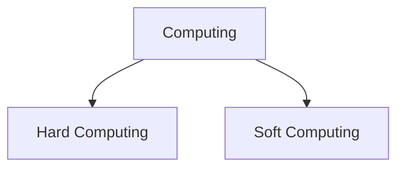

### Hard Computing

<v-clicks>

- Suitable for problems that are **easy to model mathematically**, with predictable stability
- Relies on accuracy, certainty, inflexibility
- Precise models, fast accurate solutions
- Problem: most real-world problems are hard to model mathematically
- Examples: matrix multiplication, Dijkstra's shortest path, quicksort

</v-clicks>

### Soft Computing

<v-clicks>

- Goal: solve complex real-world problems that are **not easily modeled mathematically**
- Does not need extensive mathematical formulation
- Examples: stock price trend estimation, **neural networks** recognizing distorted signals

</v-clicks>

---

# Soft Computing — Families

<v-clicks>

- Cannot always yield as precise a solution as hard computing
- Different members handle different tasks:
- **Fuzzy Logic (FL)** — dealing with imprecision and uncertainty
- **Artificial Neural Network (ANN)** — learning and adaptation
- **Genetic Algorithm (GA)** — search and optimization

</v-clicks>

---

# Hard vs. Soft Computing

<v-click>

| | Hard Computing | Soft Computing |
|---|---|---|
| Model | Precise models | Approximate models |
| Methodology | Binary logic, crisp systems | Fuzzy logic, probabilistic reasoning |
| Features | Accuracy, certainty, inflexibility | Approximation, uncertainty, flexibility |
| Nature | Deterministic | Stochastic |
| Data | Exact input data | Ambiguous, noisy data |
| Computation | Sequential | Can be parallel |

</v-click>

---

# Summary & Hybrid Computing

<v-clicks>

1. **Hard Computing** is like a calculator → always exact answers (e.g. $7 \times 6 = 42$)
2. **Soft Computing** is like a human brain → decisions despite incomplete information (e.g. recognizing a voice in a noisy call)

</v-clicks>

---

# Hybrid Computing

Combines conventional hard computing with soft computing — part of a problem solved with hard computing, the rest with soft computing, to capture the advantages of both.

**Examples**

<v-click>

1. **Credit Scoring Systems**
   - Hard computing: exact calculation of income-to-debt ratio
   - Soft computing: fuzzy/neural systems interpret vague inputs ("stable job", "moderate risk")

</v-click>

<v-click>

2. **Autonomous Drones**
   - Hard computing: exact flight-path distance and battery equations
   - Soft computing: fuzzy rules for uncertain wind/obstacle conditions

</v-click>

---

# Before Formal Optimization: Reasoning

We have **3 packages** to ship and **3 delivery trucks**. Each truck must carry exactly **one package**. Goal: minimize total **delivery cost**, respecting each truck's weight limit.

**Given:**

<v-click>

Packages (weight, cost to ship):
- $P_1$: 50 kg, cost = \$8
- $P_2$: 100 kg, cost = \$5
- $P_3$: 300 kg, cost = \$3

</v-click>

<v-click>

Trucks (weight limit):
- Truck $T_1$: 64 kg
- Truck $T_2$: 128 kg
- Truck $T_3$: 512 kg

</v-click>

<v-click>

**Rule:** a package **cannot** go on a truck if $\text{package weight} > \text{truck limit}$.

</v-click>

---

# Solving the Assignment Problem

**Step 1 — Cost matrix:**

|  | $T_1$ (64 kg) | $T_2$ (128 kg) | $T_3$ (512 kg) |
|---|---|---|---|
| $P_1$ (50 kg) | \$8 | \$8 | \$8 |
| $P_2$ (100 kg) | infeasible | \$5 | \$5 |
| $P_3$ (300 kg) | infeasible | infeasible | \$3 |

<v-click>

**Step 2 — Objective:**

$$
\text{Total cost} = C(T_1) + C(T_2) + C(T_3)
$$

</v-click>

---

# Solving the Assignment Problem — Result

<v-clicks>

- $P_3$ only fits $T_3$ → $P_3 \to T_3$
- $P_2$ cannot go on $T_1$, and $T_3$ is taken → $P_2 \to T_2$
- Therefore $T_1$ must take $P_1$

</v-clicks>

<v-click>

$$
\text{Total cost} = 8 + 5 + 3 = \$16
$$

</v-click>

---

# The Problems of Reasoning

<v-click>

**Scalability**
- Reasoning works for very small problems (few variables)
- As the problem grows (e.g. 200 packages, 80 trucks), too many possibilities for a human to check

</v-click>

<v-click>

**No guarantee of optimality**
- A "good-looking" manual solution may not be the best one

</v-click>

<v-click>

**Complex constraints**
- Real problems involve weight, size, cost, and time constraints simultaneously — hard to juggle by hand

</v-click>

<v-click>

**Time**
- Even if feasible, manual reasoning is far too slow for large-scale problems

</v-click>

---

# Before Formal Optimization: Newton–Raphson

<v-click>

Find the root of:

$$
f(x) = x^3 - 3x - 5
$$

</v-click>

<v-click>

Derivative:

$$
f'(x) = 3x^2 - 3
$$

</v-click>

<v-click>

Intermediate value theorem:

$$
f(2) = 2^3 - 3(2) - 5 = -3 \qquad f(3) = 3^3 - 3(3) - 5 = 13
$$

</v-click>

<v-click>

Root lies between 2 and 3. Initialize at $x_0 = 2$.

$$
x_{n+1} = x_n - \frac{f(x_n)}{f'(x_n)}
$$

</v-click>

---

# Newton–Raphson Iterations

<v-click>

$$
x_0 = 2 \\
f(x_0) = -3, \quad f'(x_0) = 9 \\
x_1 = 2 - \frac{-3}{9} = 2.333
$$

</v-click>

<v-click>

$$
x_1 = 2.333 \\
f(x_1) = 0.700, \quad f'(x_1) = 13.33 \\
x_2 = 2.333 - \frac{0.700}{13.33} = 2.281
$$

</v-click>

<v-click>

$$
x_2 = 2.281 \\
f(x_2) = 0.021, \quad f'(x_2) = 12.61 \\
x_3 = 2.281 - \frac{0.021}{12.61} = 2.279
$$

</v-click>

<v-click>

$$
x_3 = 2.279 \\
f(x_3) \approx 0
$$

</v-click>

<v-clicks>

- **Final root ≈ 2.279**
- Method is **gradient-dependent**
- Can take a long time to converge for harder functions

</v-clicks>

---

# Newton–Raphson Convergence

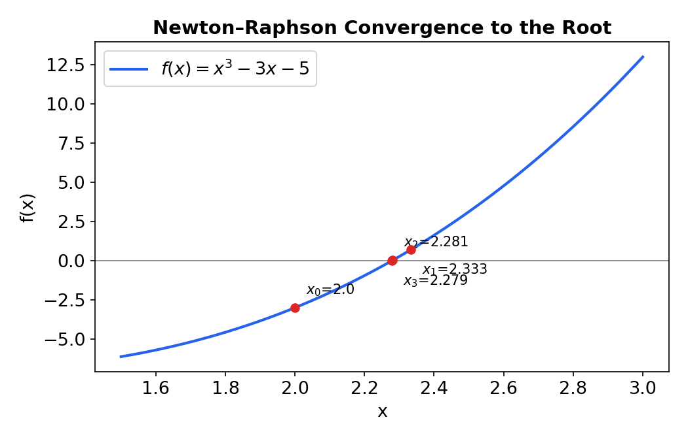

---

# Optimization

<v-clicks>

- The process of finding the **best solution** out of all feasible solutions
- **No Free Lunch (NFL) theorem:** no single algorithm is best for all problems
- Averaged over all possible problems, every algorithm performs the same

</v-clicks>

<v-click>

**Implication:** if an algorithm excels on one class of problems, it must underperform on another — advantage on some problems is balanced by disadvantage on others. We must choose/design the algorithm to fit the **problem's structure**.

</v-click>

---

# NFL Example

<v-click>

Two models:
- **Model A:** Decision Tree
- **Model B:** LSTM

</v-click>

<v-click>

Two datasets:
- **Dataset 1:** house prices from size, location, and number of rooms (simple, structured table) — easy for a Decision Tree
- **Dataset 2:** daily temperatures over the past month, used to predict tomorrow's (a sequence over time) — easier for an LSTM

</v-click>

<v-click>

**Step 1 — Performance:**
- On Dataset 1: Decision Tree → performs very well, LSTM → performs poorly
- On Dataset 2: Decision Tree → performs poorly, LSTM → performs very well

</v-click>

---

<v-click>

**Step 2 — Averaged over all possible datasets:** both models score the same overall

</v-click>

<v-click>

**Conclusion:** no single model always wins — choose based on the problem's structure (e.g. sequence models for time-based data, tree models for tabular data)

</v-click>

---

# Formal Description

Find $x^*$ such that:

$$
x^* = \arg\min_{x \in S} f(x) \qquad \text{or} \qquad x^* = \arg\max_{x \in S} f(x)
$$

Where:

<v-clicks>

- $x$: decision variable (vector in $\mathbb{R}^n$)
- $f(x)$: cost, objective, or fitness function
- $S$: feasible set (may include constraints)

</v-clicks>

---

# Optimization ≠ Always Minimization

<v-click>

**Optimization ≠ always minimization** — we can minimize cost/loss or maximize performance/accuracy.

</v-click>

<v-click>

**Example:**

$$
f(x) = (x-5)^2, \quad x \in S
$$

</v-click>

<v-clicks>

- Minimum value of $f(x)$ is $0$
- The point where this happens is $x = 5$

</v-clicks>

<v-click>

$$
\min f(x) = 0 \qquad \arg\min f(x) = 5
$$

</v-click>

---

# Types of Optimization Problems (1)

### Linear vs. Nonlinear Optimization

<v-click>

**Linear Optimization**
- Objective and constraints are linear
- Solved efficiently (e.g. Simplex method)

$$
\min f(x,y) = 4x + 2y \quad \text{s.t.} \quad x + y \leq 8
$$

</v-click>

<v-click>

**Nonlinear Optimization**
- Objective or constraints are nonlinear
- May have multiple local minima

$$
\min f(x) = x^2 + \cos(x)
$$

</v-click>

---

# Linear vs. Nonlinear — Visualized

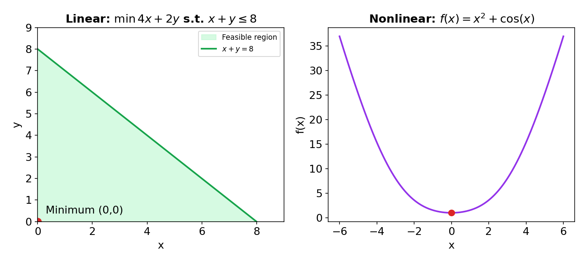

---

# Types of Optimization Problems (2)

### Continuous vs. Discrete Optimization

<v-click>

**Continuous Optimization** — variables take values in a continuous range

$$
\min f(x) = x^2, \quad x \in \mathbb{R}
$$

</v-click>

<v-click>

**Discrete Optimization** — variables restricted to integers or finite sets

$$
\min f(x) = x^2, \quad x \in \{0, 1, 2, 3, 4\}
$$

</v-click>

---

# Continuous vs. Discrete

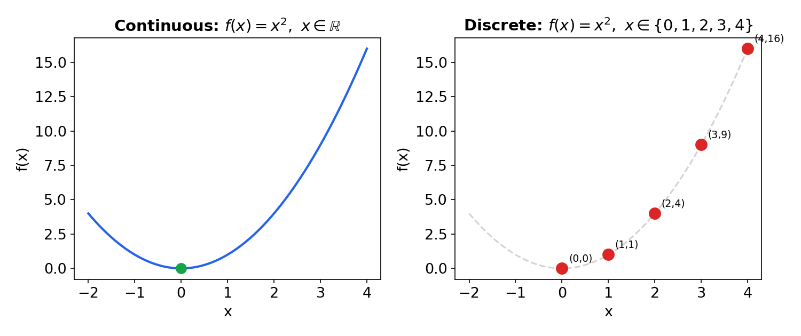

---

# Types of Optimization Problems (3)

### Constrained vs. Unconstrained Optimization

<v-click>

**Constrained** — variables must satisfy conditions

$$
\min f(x) = x^2, \quad \text{s.t.} \quad x \geq 2 \;\Rightarrow\; x^* = 2
$$

</v-click>

<v-click>

**Unconstrained** — no restrictions

$$
\min f(x) = x^2 \;\Rightarrow\; x^* = 0
$$

</v-click>

---

# Constrained vs. Unconstrained

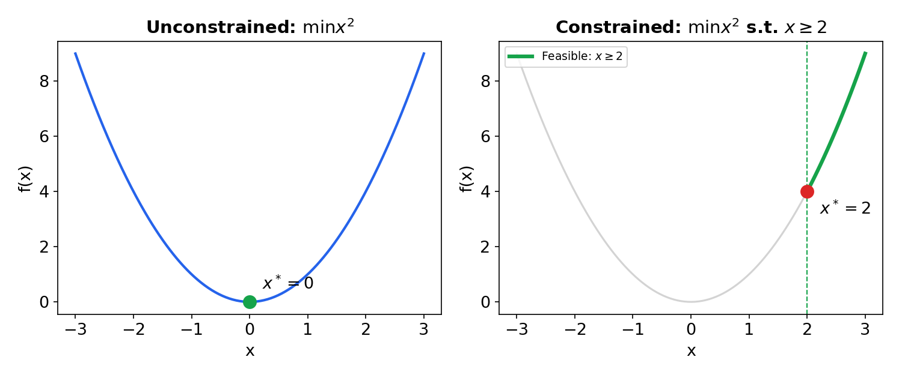

---

# Deterministic vs. Stochastic Optimization

<v-clicks>

- **Deterministic**: same input → same solution (e.g. Linear Programming)
- **Stochastic**: incorporates randomness, solutions vary between runs (e.g. Genetic Algorithm)

</v-clicks>

---

# Optimization Methods

<v-click>

1. **Exact methods**
   - Guarantee the accurate optimal solution (dynamic programming, branch-and-bound, integer linear programming)
   - Worst case: time complexity grows exponentially with problem size
   - Suitable for small-scale problems

</v-click>

<v-click>

2. **Approximate methods** (our target in this course)
   - Cannot guarantee the exact optimal solution
   - Reach a good solution in acceptable, reasonable time
   - Suitable for large-scale problems

</v-click>

---

# Heuristic vs. Metaheuristic

<v-click>

| | Heuristic | Metaheuristic |
|---|---|---|
| Scope | Problem-dependent | Problem-independent (general framework) |
| Flexibility | Works well for one domain | Adaptable to many domains |
| Optimality | Often good, not guaranteed optimal | Near-optimal, no guarantee |
| Solution type | Approximate | Approximate |
| Examples | Nearest neighbor, greedy, rule-based | GA, PSO, ACO, SA, Tabu Search |
| Speed | Fast | Moderate but scalable |
| Inspiration | Human intuition, simple rules | Nature/physics-inspired or strategy-based |

</v-click>

---

# Families of Metaheuristic Algorithms

Understanding this classification helps us:

<v-clicks>

- Compare major metaheuristic algorithms
- Understand how they work
- Know when to use each algorithm

</v-clicks>

<v-click>

| Family | Inspiration | Examples | Key Features |
|---|---|---|---|
| Evolutionary-based | Biological evolution, natural selection | GA, Evolution Strategies (ES), Differential Evolution (DE) | Crossover & mutation, population-based, strong exploration |
| Swarm-based | Collective behavior of animals/insects | PSO, ACO, Artificial Bee Colony (ABC), Firefly | Agents cooperate & share info, balances exploration/exploitation |
| Physics/Chemistry-inspired | Physical & chemical processes | Simulated Annealing (SA), Gravitational Search (GSA), Harmony Search | Probabilistic moves, escapes local minima |

</v-click>

---

# Why Metaheuristic Instead of Gradient Descent?

<v-clicks>

1. **Non-differentiable functions** — gradient needs derivatives; metaheuristics work with discrete/jump functions
2. **Local minima & saddle points** — gradient can get stuck; metaheuristics explore broadly
3. **Multi-modal problems** — many peaks/valleys mislead gradients; metaheuristics track multiple solutions at once
4. **Curse of dimensionality** — search space grows exponentially; gradient struggles, swarms explore better
5. **Exploration vs. exploitation balance** — gradient is local refinement only; metaheuristics combine global + local search
6. **No gradient information needed** — black-box functions only need evaluations, not derivatives

</v-clicks>

---

# 1) Non-differentiable Functions

Define an objective function:

$$
f(x) =
\begin{cases}
x^2 + \cos(8x) & \text{if } x < 2 \\
12 & \text{otherwise}
\end{cases}
$$

**This function:**

<v-click>

- Has a discontinuity at $x = 2$, so the gradient is **undefined** there:

$$
\lim_{h \to 0^-} \frac{f(2) - f(2-h)}{h} \neq \lim_{h \to 0^+} \frac{f(2+h) - f(2)}{h}
$$

</v-click>

<v-clicks>

- Cannot be differentiated symbolically at that point
- Gradient-based methods fail; metaheuristics still work by evaluating $f(x)$ at multiple points
- Models real simulation outputs (e.g. cost of a robotic arm trajectory)

</v-clicks>

---

# Discontinuity

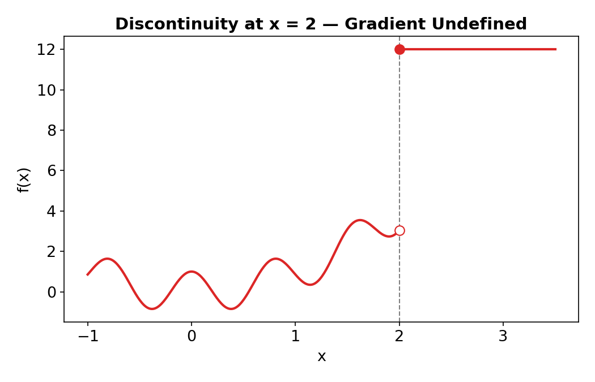

---

# Hyperparameter Example (Non-differentiable Case)

Tuning a spam filter to minimize the number of real emails wrongly marked as spam:

<v-clicks>

- $x_1$ = spam-score threshold, continuous: $x_1 \in [0.5, 0.95]$
- $x_2$ = number of past emails checked for context, discrete: $x_2 \in \{10, 20, 30\}$ emails

</v-clicks>

<v-click>

**Why gradient methods fail:**
- Cannot differentiate with respect to a discrete count of emails (10 → 20 → 30 are categorical jumps)
- The error rate is noisy, so even the threshold gradient is unstable

</v-click>

<v-click>

Example of an invalid "gradient step":

$$
\text{threshold} = 0.6,\ \text{emails checked} = 20 \;\longrightarrow\; \text{threshold} = 0.7,\ \text{emails checked} = 30
$$

This is a jump, not a smooth path.

</v-click>

---

# 2) Local Minima & Saddle Points

<v-click>

**Convex function** → bowl-shaped, easy
- Any local minimum = global minimum
- Gradient descent always succeeds

$$
f(x) = x^2
$$

</v-click>

<v-click>

**Non-convex function** → wavy, tricky
- May have multiple local minima
- Gradient descent may get stuck, missing the true bottom at $x=0$

$$
f(x) = x^2 + 4\sin^2(x)
$$

</v-click>

---

# Convex vs. Non-convex

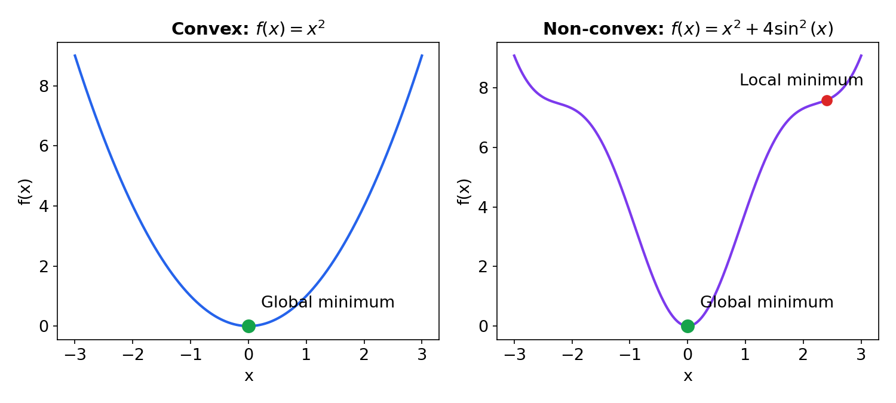

---

# 3) Multi-modal Problems

<v-click>

**Unimodal**
- One peak/trough → easy to optimize
- Slope always points toward the global minimum

</v-click>

<v-click>

**Multimodal**
- Many minima/maxima → hard for greedy methods
- Slope may point toward the wrong valley → gradient descent gets trapped

</v-click>

---

# Unimodal vs. Multimodal

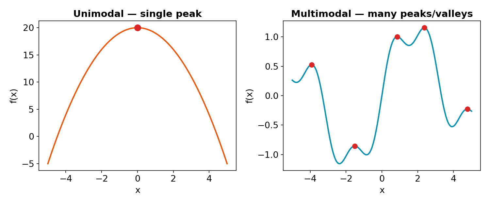

---

# 4) Curse of Dimensionality

As the number of dimensions increases, the search space grows exponentially.

Suppose we tune the settings of a spam filter:

<v-click>

| Setting | Choices | Values |
|---|---|---|
| Spam threshold | 4 | {0.6, 0.7, 0.8, 0.9} |
| Emails checked for context | 3 | {10, 20, 30} |
| Word-weighting method | 3 | {frequency, TF-IDF, binary} |
| Filter type | 4 | {Naive Bayes, SVM, Neural Net, Rule-based} |
| Feature set | 3 | {basic, extended, full} |

</v-click>

---

# Curse of Dimensionality — How Fast It Grows

<v-click>

**Case 1 (1D — only threshold):** 4 options → easy to search

</v-click>

<v-click>

**Case 2 (5D — all together):**

$$
4 \times 3 \times 3 \times 4 \times 3 = 432
$$

</v-click>

<v-click>

**Case 3 (10 settings, 4 options each):**

$$
4^{10} = 1{,}048{,}576 \text{ combinations — infeasible to check exhaustively}
$$

</v-click>

---

# Search Space Growth

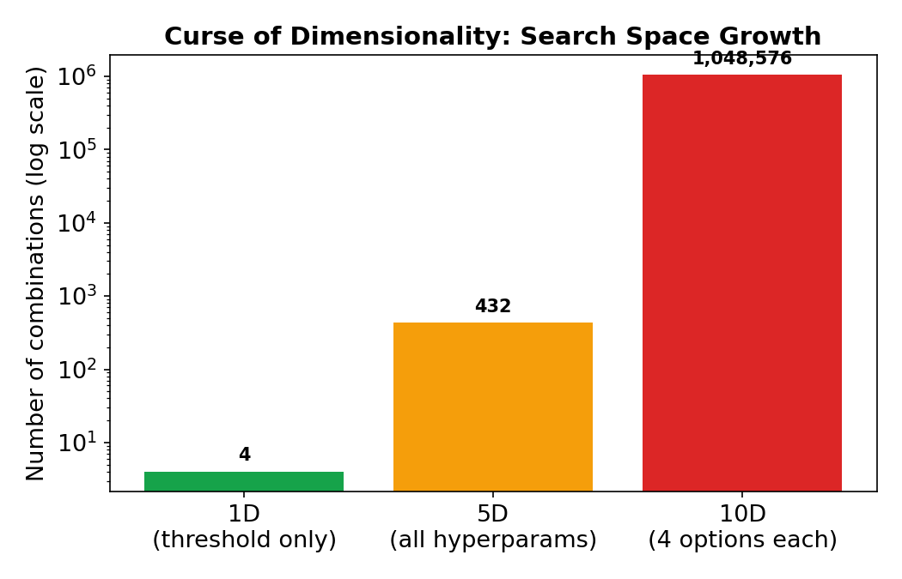

---

# 5) Exploration vs. Exploitation

<v-clicks>

- **Exploration** — searching new areas globally to discover regions with potentially better solutions
- **Exploitation** — intensively refining known good areas to converge toward the local/global optimum

</v-clicks>

### Worked Example

$$
f(x) = x^2 + \sin(2x), \quad x \in \{-2, -1, 0, 1, 2\}
$$

<v-click>

**Step 1 — Exploration:** test $x = -2, 0, 2$

$$
f(-2) = 4.757 \qquad f(0) = 0 \qquad f(2) = 3.243
$$

$x = 0$ looks promising.

</v-click>

<v-click>

**Step 2 — Exploitation:** check neighbors $\{-1, 1\}$

$$
f(-1) = 0.091 \qquad f(1) = 1.909
$$

Local refinement confirms $x = 0$ is the best in this neighborhood.

</v-click>

---

# Exploration vs. Exploitation

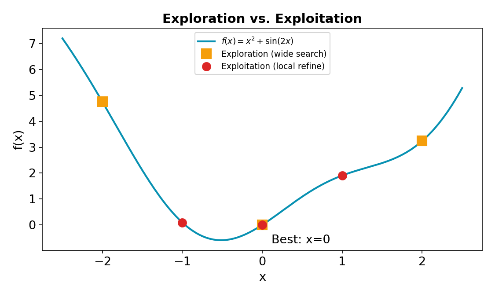

---

# From Concepts to Practice

<v-click>

**As AI engineers today:**
1. We can design machine learning and deep learning models
2. We can also make these models more interpretable and explainable

</v-click>

<v-click>

**But the big question is:**
1. How can we apply **Metaheuristics** to optimize these models?
2. What is the **core idea** behind this approach?

</v-click>

---

# Worked Example: Tuning with a Swarm-style Update

Small model to classify emails (spam vs. not spam). We want to find the best **learning rate** and **batch size** to **maximize** F1-score.

$$
x_1 = \text{learning rate} \in [0.0001, 0.1] \qquad x_2 = \text{batch size} \in [8, 128]
$$

$$
\text{F1-score} = f(\text{learning rate}, \text{batch size})
$$

<v-click>

**Step 1 — Initialize with 3 random values:**

| Value | Learning rate | Batch size |
|---|---|---|
| $V_1$ | 0.001 | 16 |
| $V_2$ | 0.010 | 32 |
| $V_3$ | 0.005 | 64 |

</v-click>

---

<v-click>

**Step 2 — Evaluate fitness (train and measure F1):**

| Value | Learning rate | Batch size | F1-score |
|---|---|---|---|
| $V_1$ | 0.001 | 16 | 80% |
| $V_2$ | 0.010 | 32 | **91%** ← best |
| $V_3$ | 0.005 | 64 | 86% |

</v-click>

---

# Step 3 — Update Positions (Exploration + Exploitation)

Move each candidate toward the best solution, plus random noise:

$$
x_{\text{new}} = x_{\text{current}} + \alpha \left( x_{\text{best}} - x_{\text{current}} \right) + \text{noise}
$$

Where $\alpha = 0.15$ is the step coefficient (small = stable; too large = little exploration). Best so far: $V_2$ (lr = 0.010, batch = 32).

<v-click>

| Value | New learning rate | New batch size |
|---|---|---|
| $V_1$ | $0.001 + 0.15(0.010-0.001) + 0.0002 = 0.00255$ | $16 + 0.15(32-16) + 1 = 19.4 \approx 19$ |
| $V_2$ (best) | $0.010 + 0.15(0) - 0.0004 = 0.0096$ | $32 + 0.15(0) + 2 = 34$ |
| $V_3$ | $0.005 + 0.15(0.010-0.005) + 0.0006 = 0.00635$ | $64 + 0.15(32-64) - 3 = 56.2 \approx 56$ |

</v-click>

---

# Candidate Movement

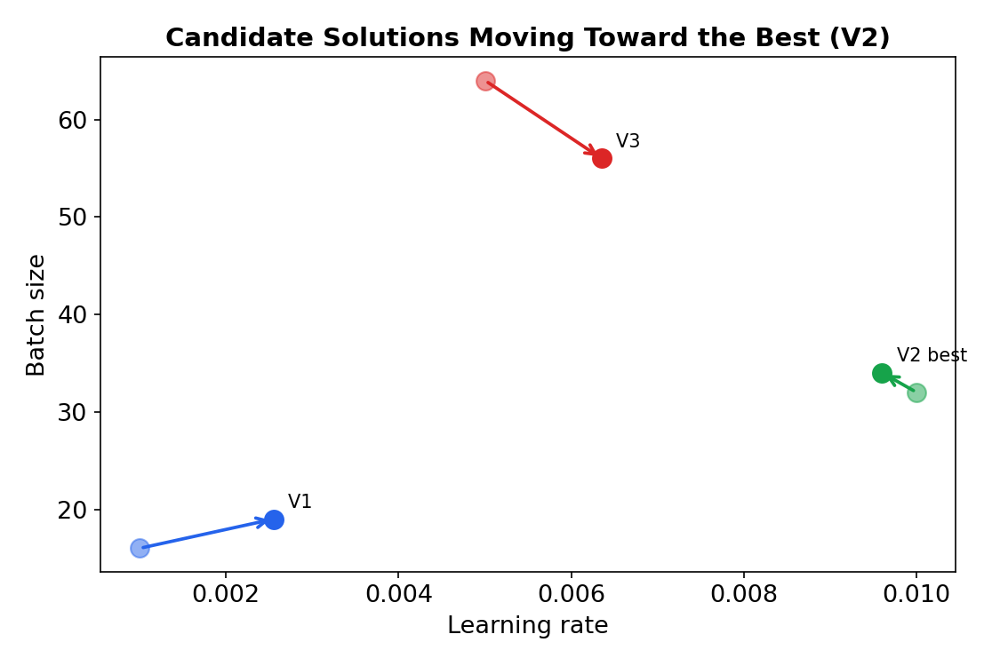

---

# Step 4 & 5 — Repeat and Converge

<v-click>

**Step 4 — Re-evaluate fitness:**

| Value | Learning rate | Batch size | F1-score |
|---|---|---|---|
| $V_1$ | 0.00255 | 19 | 83% |
| $V_2$ | 0.0096 | 34 | **93%** |
| $V_3$ | 0.00635 | 56 | 88% |

</v-click>

<v-click>

**Step 5 — Repeat updating until F1-score stops improving:**

- If F1-score does not improve further after this iteration:
- **Best hyperparameters found:** learning rate $\approx 0.0096$, batch size $\approx 34$
- **F1-score $\approx$ 92–93%**

</v-click>

---

# References

<v-clicks>

1. R. L. Burden and J. D. Faires, *Numerical Analysis*, 9th ed. Boston, MA: Cengage Learning, 2010.
2. J. Nocedal and S. J. Wright, *Numerical Optimization*, 2nd ed. New York, NY: Springer, 2006.
3. D. H. Wolpert and W. G. Macready, "No free lunch theorems for optimization," *IEEE Transactions on Evolutionary Computation*, vol. 1, no. 1, pp. 67–82, 1997. doi: 10.1109/4235.585893
4. J. H. Holland, *Adaptation in Natural and Artificial Systems*. Ann Arbor, MI: University of Michigan Press, 1975.
5. E.-G. Talbi, *Metaheuristics: From Design to Implementation*. Hoboken, NJ: Wiley, 2009.

</v-clicks>

 

DSAI 403 — Nature Inspired Computation
Zewail City of Science, Technology, and Innovation